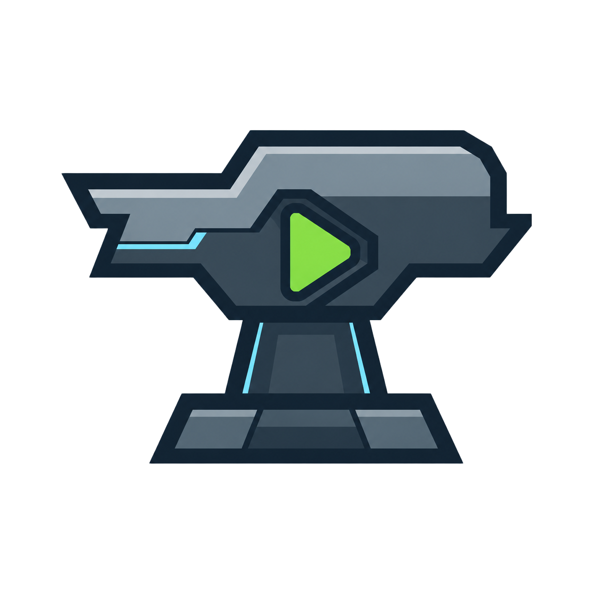

<div align="center">
  
  <h1>anvil</h1>
  <p>Crée un launcher Minecraft natif en écrivant seulement du HTML.<br>Le backend Rust gère tout le reste.</p>

  [](https://github.com/ThomasFarineau/anvil/releases)
  [](./LICENSE)
  [](https://github.com/ThomasFarineau/anvil/actions)
</div>

---

**anvil** est un framework qui génère un launcher Minecraft natif (Windows · macOS · Linux) à partir d'un fichier `config.json` et d'une page HTML. Le backend Rust intégré gère :

- Téléchargement et gestion de Java
- Téléchargement des assets Minecraft (vanilla, Fabric, Forge…)
- Lancement du jeu avec gestion des sessions
- Mises à jour automatiques via URL
- Génération des icônes d'application

Vous ne touchez qu'au **frontend**.

## Prérequis

- [Node.js](https://nodejs.org) ≥ 18
- [Rust](https://rustup.rs) (stable)
- [Prérequis Tauri v2](https://tauri.app/start/prerequisites/) (WebView2 sur Windows, Xcode sur macOS)

## Démarrage rapide

```bash
npx anvil create mon-launcher
cd mon-launcher
npm install
npm run dev
```

Ou dans un projet existant :

```bash
npm install -D anvil
npx anvil init
npm run dev
```

## Commandes

| Commande | Description |
|---|---|
| `npx anvil create <nom>` | Crée un nouveau projet dans `<nom>/` |
| `npx anvil init` | Initialise anvil dans le dossier courant |
| `npx anvil dev` | Lance le launcher en mode développement |
| `npx anvil build` | Compile le launcher pour la distribution |
| `npx anvil update` | Met à jour le backend Rust et `api.js` vers la dernière version |

## Structure du projet

```
mon-launcher/
├── config.json          ← configuration du launcher
├── src/
│   ├── index.html       ← votre interface (HTML/CSS/JS)
│   ├── api.js           ← pont JS ↔ Rust  (ne pas modifier)
│   └── logo.svg         ← logo de votre launcher (optionnel)
└── src-anvil/           ← généré par anvil  (ne pas modifier)
```

## config.json

```json
{
  "$schema": "node_modules/anvil/src/client/config.schema.json",
  "identifier": "com.monentreprise.launcher",
  "app_name": "Mon Launcher",
  "data_folder": ".mon-launcher",
  "java_version": 21,
  "logo": "logo.svg",
  "session": "none",
  "update_url": "",
  "target": "dist",
  "window_decorations": true,
  "window_resizable": false,
  "instances": [
    {
      "id": "survival",
      "name": "Survie",
      "mc_version": "1.21.4"
    },
    {
      "id": "modded",
      "name": "Moddé",
      "mc_version": "1.21.4",
      "loader": "fabric",
      "loader_version": "0.16.9"
    }
  ]
}
```

### Référence des champs

| Champ | Type | Description |
|---|---|---|
| `identifier` | `string` | Identifiant reverse-domain (ex: `com.studio.launcher`) |
| `app_name` | `string` | Nom affiché dans la fenêtre native et l'interface |
| `data_folder` | `string` | Sous-dossier dans `%APPDATA%` / `~/Library` pour les données du jeu |
| `java_version` | `17` \| `21` | Version Java à télécharger automatiquement |
| `logo` | `string` | Chemin vers le logo (relatif à `src/`) — `.svg` ou `.png`, converti auto en icône |
| `session` | `"none"` \| `"mojang"` \| `"custom"` | Mode d'authentification |
| `update_url` | `string` | URL du manifeste de mise à jour (laisser vide pour désactiver) |
| `target` | `string` | Dossier de sortie des exécutables compilés (ex: `dist`) |
| `window_decorations` | `boolean` | Affiche la barre de titre native |
| `window_resizable` | `boolean` | Autorise le redimensionnement de la fenêtre |
| `instances` | `array` | Liste des instances Minecraft disponibles |

### Champs des instances

| Champ | Type | Description |
|---|---|---|
| `id` | `string` | Identifiant unique (utilisé comme nom de dossier) |
| `name` | `string` | Nom affiché sur le bouton de jeu |
| `mc_version` | `string` | Version Minecraft (ex: `"1.21.4"`) |
| `loader` | `"fabric"` \| `"forge"` \| `"neoforge"` \| `"quilt"` | Mod loader (optionnel) |
| `loader_version` | `string` | Version du mod loader (ex: `"0.16.9"`) |
| `server_ip` | `string` | IP du serveur pour connexion automatique |
| `server_port` | `number` | Port du serveur (défaut: `25565`) |

## Session

### `"none"` — Offline

Le joueur entre son pseudo directement dans l'interface. Aucune authentification requise.

### `"custom"` — Authentification externe

Vous gérez l'authentification côté client (OAuth, API maison…) et transmettez la session à anvil :

```js
await MC.setSession({
  username: 'Steve',
  uuid: '...',
  access_token: '...',
});

// Pour déconnecter :
await MC.clearSession();
```

## API JavaScript

Importez `api.js` dans votre HTML :

```html
<script type="module">
  import { MC } from '/api.js';
</script>
```

### Référence

```js
// Config & paramètres
MC.getConfig()                            // → LauncherConfig
MC.getSettings()                          // → Settings
MC.saveSettings(settings)                 // → void
MC.getDefaultDir()                        // → string (chemin %APPDATA%/... par défaut)

// Installation
MC.getInitStatus()                        // → InitStatus  (java_ok, instances[])
MC.runSetup()                             // → void  (lance le téléchargement)

// Jeu
MC.verify(instanceId)                     // → void  (vérifie les fichiers)
MC.play(instanceId)                       // → void  (lance le jeu)

// Session  (session: "custom")
MC.setSession({ username, uuid, access_token })
MC.clearSession()

// Mises à jour
MC.checkUpdate()                          // → UpdateInfo | null
MC.doUpdate(url)                          // → void

// Fenêtre
MC.close()                               // ferme l'application

// Événements
MC.on.setupProgress(cb)   // cb({ step, current, total, label, error })
MC.on.setupDone(cb)       // cb()
MC.on.gameStarting(cb)    // cb(instanceId)
MC.on.gameOutput(cb)      // cb({ instance_id, text, stderr })
MC.on.gameExit(cb)        // cb({ instance_id, code })
```

## Icône d'application

Placez votre logo dans `src/` et renseignez le champ `logo` dans `config.json`. anvil le convertit automatiquement en icônes multi-tailles lors du `init` :

- `.svg` → converti en PNG via **sharp**, puis généré en toutes tailles
- `.png` → utilisé directement (recommandé : 1024×1024)

## Build & distribution

```bash
npm run build   # → anvil build → tauri build
```

Les artefacts de distribution sont générés dans le dossier `target` configuré :

| Plateforme | Format |
|---|---|
| Windows | `<nom>_<ver>_x64-setup.exe` (NSIS) |
| Linux | `<nom>_<ver>_amd64.AppImage` |
| macOS | `<nom>_<ver>_x64.dmg` |

## Licence

MIT © [Thomas Farineau](https://github.com/ThomasFarineau)
